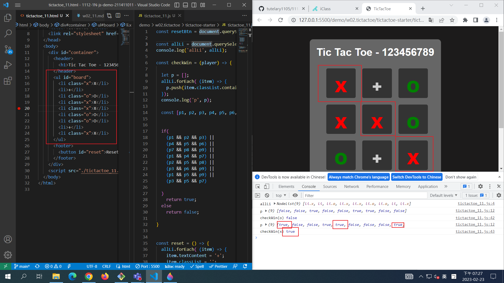
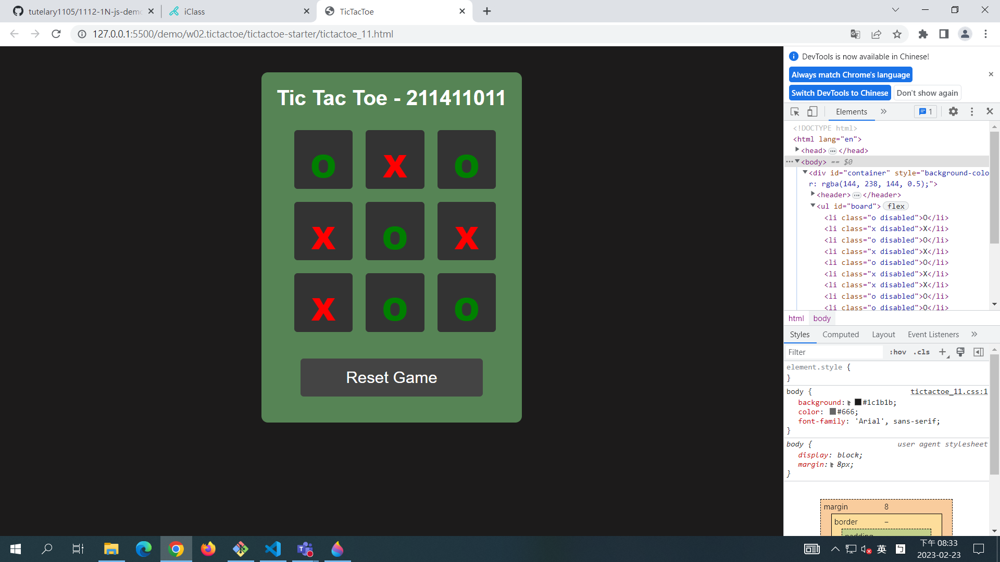
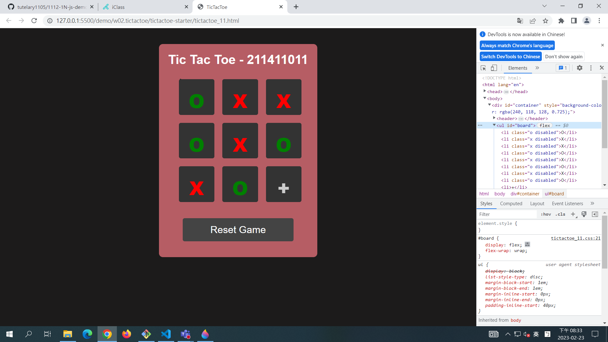
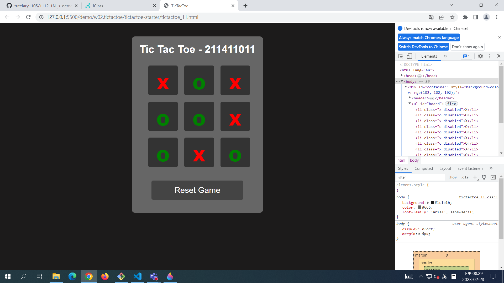

## [Github URL](https://github.com/tutelary1105/1112-1N-js-demo-211411011)

### W02-P1: checkWin to determine who wins, you need to create four images as said in class

### W02-P2: O win (9 times), X wins (8 times), tie (9 times)

### W01-P3: 能做減法計算 operand1 - operand2

### W01-P4: 能做乘法計算 operand1 \* operand2

### W01-P5: 能做除法計算 operand1 / operand2

### W01-P6: 能做四則計算，加減乘除都要執行一遍，可任意順序，結果要正確

